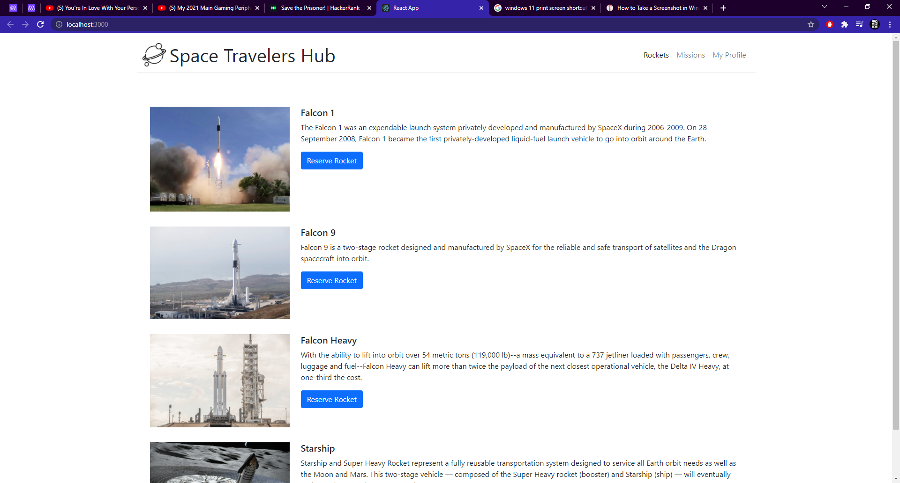
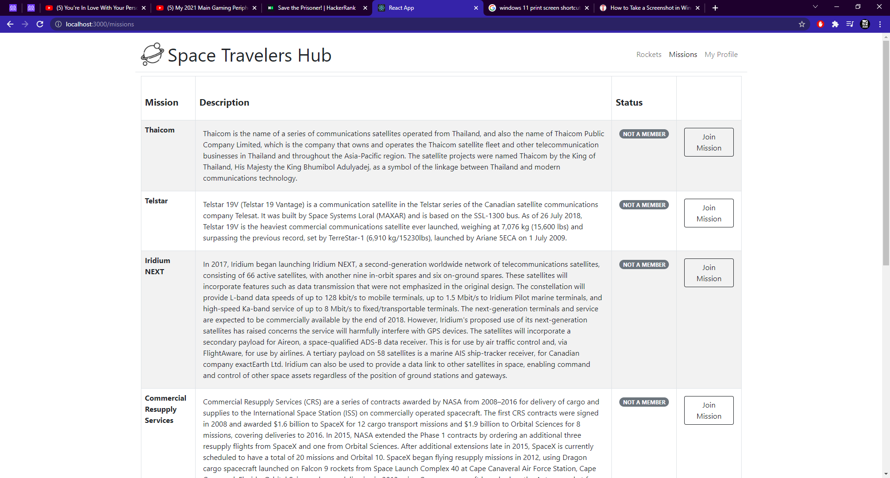
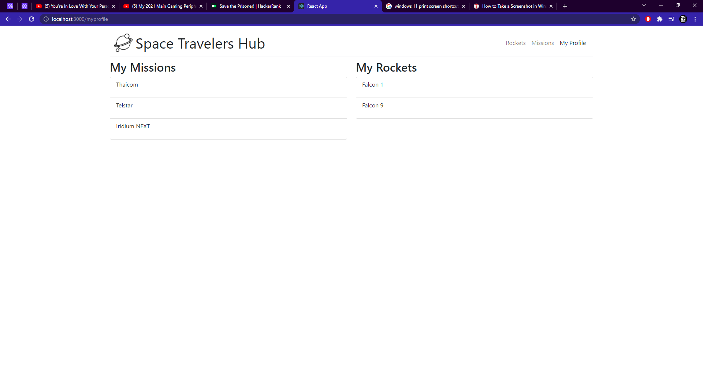

# Space Travelers Hub

 This app display rockests and missions form space X company. The app contain two 3 pages:
- Rockets: to see all rockets by now, you also have the option to reserve a rocket
- Missions: you can see all the missions and join then.
- My profile: where you can see all the reserved rockets and joinend missions.

 This is a group activity, all was made with react and redux.

   

## Built With

- JavaScript
- HTML & CSS
- Bootstrap
- Webpack
- Jest testing framework
- Git and Github pages
- VSCode
- Linter Checkers

## Deployment Live Demo

Deployed with Heroku
  - [Live Demo](https://spacetravelershub.herokuapp.com/)

## Getting Started

To get a local copy up and running follow these simple example steps.

### Prerequisites

- IDE to edit and run the code (We use Visual Studio Code 🔥).
- [Node.js](https://nodejs.org/en/download/) already downloaded.
- Webpack - [click here to getting started](https://webpack.js.org/guides/getting-started/).

### Install

To get a local copy up and running follow these simple example steps.
- Open terminal
- Clone this project using the command
```
git clone https://github.com/AdedayoOpeyemi/space_travelers_hub.git
```
- Select the folder
```
`cd <space travelers hub>`
```
- To install all project dependencies run:
```
npm install
```
- To start the local server run:
```
npm start
```

## Authors 👤 

👤 **Opeyemi Oyelesi**
```
- GitHub: [@AdedayoOpeyemi](https://github.com/AdedayoOpeyemi)
- Twitter: [@Oyelesiopy](https://twitter.com/Oyelesiopy)
- LinkedIn: [Opeyemi Oyelesi](https://linkedin.com/in/opeyemioyelesi)
```

👨‍💻 **Jose Alberto Arriaga Ramos**
```
- GitHub: [@jaarkira](https://github.com/jaarkira )
- Twitter: [@91_jaar](https://twitter.com/91_jaar )
- LinkedIn: [Jose Arriaga](https://www.linkedin.com/in/jaar/)
```

## 🤝 Contributing

Contributions, issues, and feature requests are welcome!

Feel free to check the [issues page](https://github.com/DanSam5K/Webflix-Index/issues).

## Show your support

Give a ⭐️ if you like this project!


## Acknowledgments

- Hat tip to anyone whose code was used 🔰
- Inspiration 💘
- Microverse program ⚡
- Our standup team 🏹
- Our family's support 🙌

## 📝 License

This project is [MIT](./LICENSE) licensed.
